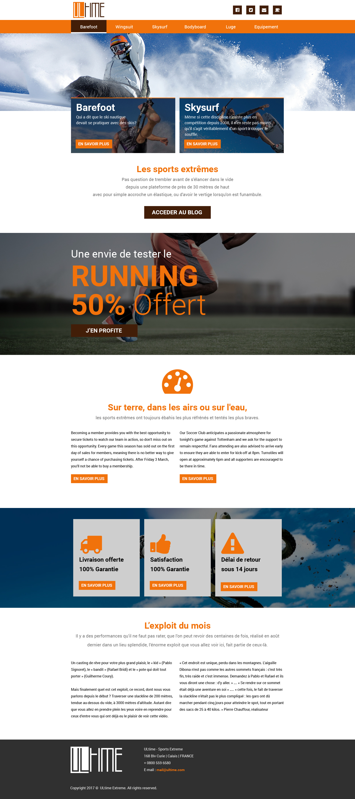

# ULTIME

## Énoncé Ultime

Intégration Web en HTML ET CSS de la maquette ULTIME Intégration Web trois formats :
Vous pouvez faire l'intégration Web en Less ou en CSS (A vous de voir).  
Les documents sont disponible sur la plateforme Form-e  

* Format PC
* Format Tablette
* Format Mobile   

   

&nbsp;&nbsp;
